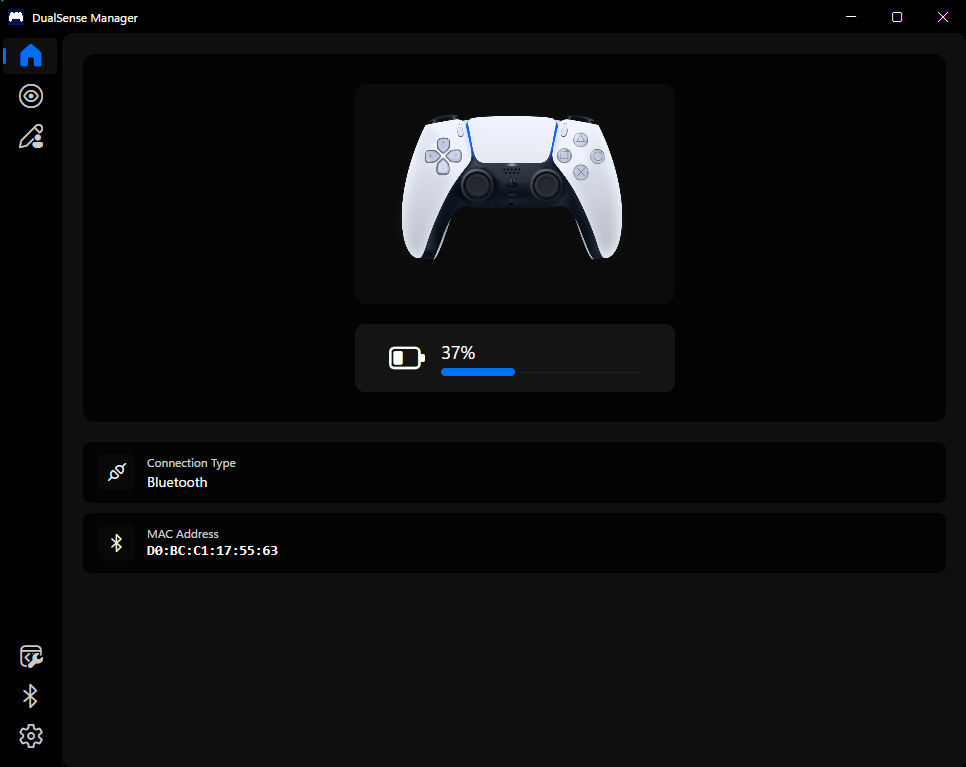

<h1 align="center"> DualSense Client</h1>

  <b>Unofficial DualSense Manager for Windows</b> 
  Advanced customization and control of your PS5 DualSense controller with real-time monitoring and custom profiles.

---

  
  
  

  
  

  

  

---

## 🧾 Overview

**DualSenseClient** is a comprehensive management tool for the **PlayStation 5 DualSense Controller** on Windows. It provides deep customization, real-time monitoring, and advanced features for full control of your DualSense experience. Built with modern .NET technology and Avalonia UI, it offers an intuitive and powerful interface for managing your controller settings.

---

## 🌟 Features

### 🎨 Light Control
- Full RGB lightbar control with presets and custom colors
- Player LED control (1-5) with brightness options
- Microphone LED configuration (off/on/pulse)
- Quick light presets and reset functions

### 📁 Profile Management
- Create, edit, and manage multiple controller profiles
- Import/export profiles (JSON format)
- Profile renaming and duplication
- Assign profiles to specific controllers

### ⚡ Special Actions
- Custom button combinations for special functions
- Battery level indicators (via lightbar/LEDs)
- Controller disconnection via button combos

### 📊 Real-time Monitoring
- Monitor all controller inputs and states
- View touchpad, motion sensor, and battery data
- Track connection status and LED states

### 🎮 Device Management
- Support for multiple DualSense controllers
- Automatic MAC address-based identification
- Connection type detection (USB/Bluetooth)

### ⚙️ Settings & Configuration
- Theme selection and UI customization
- Minimize to tray and start minimized options
- Adjustable logging levels
- Tray battery tracking

---

## 📚 Libraries Used

### 🖥️ User Interface

- [Avalonia](https://avaloniaui.net/) — Cross-platform .NET UI framework
- [Fluent Avalonia](https://github.com/amwx/FluentAvalonia) — Fluent Design System for Avalonia
- [Fluent Icons](https://github.com/davidxuang/FluentIcons) — Fluent icon set for modern interfaces

### ⚙️ Functionality

- [HidSharp](https://github.com/SeekHisKingdom/HIDSharp) — Cross-platform HID device access
- [NLog](https://github.com/NLog/NLog) — Flexible and high-performance logging library

---

## 🚀 Getting Started

### Prerequisites

- Windows 10 or later
- .NET 9.0 or later
- PlayStation 5 DualSense controller (wired or Bluetooth connection)

### Installation

1. Download the latest release from the [releases page](https://github.com/shazzaam7/DualSenseClient/releases)
2. Extract the archive to your preferred location
3. Run `DualSenseClient.exe`
4. Connect your DualSense controller and start customizing

### Quick Start

1. Connect your DualSense controller to your PC (via USB or Bluetooth)
2. Navigate to the Profile page to customize your settings
3. Create and apply your first profile or adjust individual settings

---

## 🙌 Credits

- [DualSense Controller Mockup](https://www.titanui.com/106136-ps5-dualsense-controller-vector-illustration-figma) — Mockup design for DualSense controller
- [DualSense Controllers Fandom](https://controllers.fandom.com/wiki/Sony_DualSense) — Detailed documentation and reference
- [DS4Windows](https://github.com/Ryochan7/DS4Windows/) & [DualSense API](https://github.com/BadMagic100/DualSenseAPI/) — API implementation for DualSense controller functionality in C#

---

## ⚠️ Disclaimer

> This project is not affiliated with or endorsed by **Sony Interactive Entertainment**.
> "PlayStation", "DualSense", and related marks are trademarks of their respective owners.

---

## 🛠️ Contributing

Pull requests are welcome! If you'd like to improve this tool or report bugs, feel free to open an issue or start a discussion.

To contribute:

1. Fork the repository
2. Create a feature branch (`git checkout -b feature/amazing-feature`)
3. Commit your changes (`git commit -m 'Add amazing feature'`)
4. Push to the branch (`git push origin feature/amazing-feature`)
5. Open a pull request

---

## 📄 License

Released under the [BSD-3 License](LICENSE).

---

  Made with ❤️ for DualSense fans.

